# 设计模式类图汇总

* 模板方法

  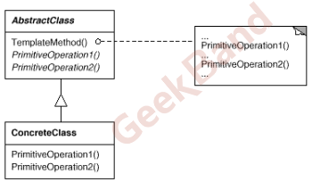

* 策略模式

  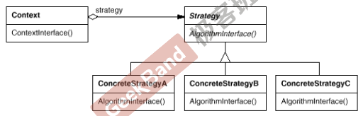

* 观察者模式

  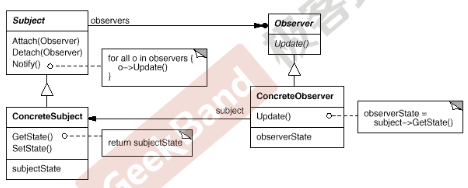

* 装饰器模式

  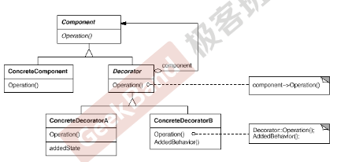

* 桥模式

  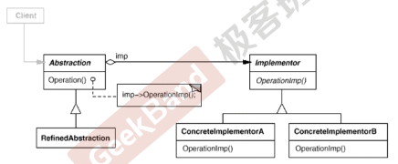

* 工厂方法

  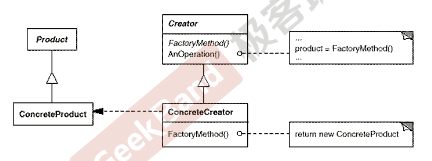

* 抽象工厂

  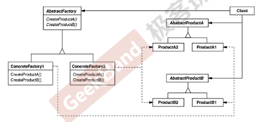

* 原型模式

  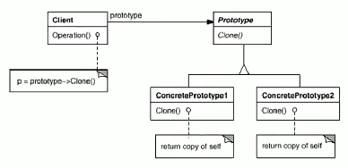

* 建造者模式

  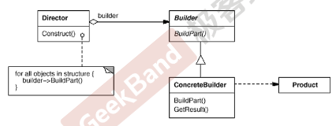

* 单例模式

  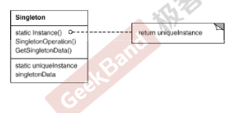

* 享元模式

  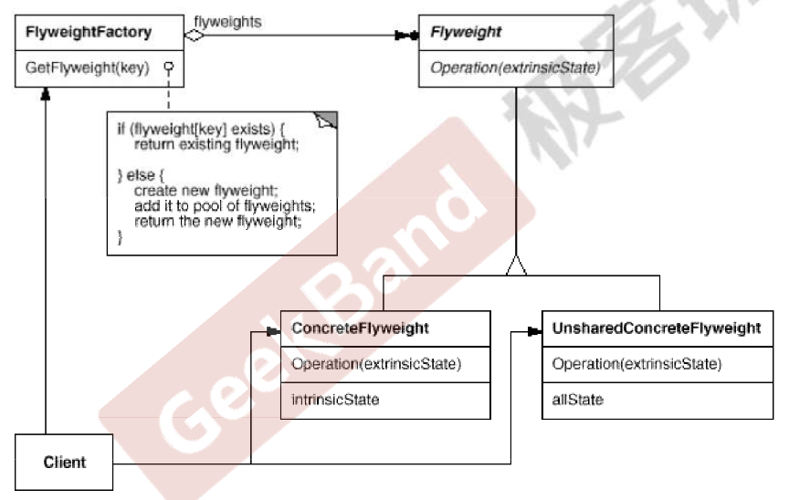

* 门面模式

  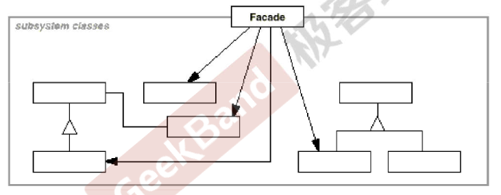

* 代理模式

  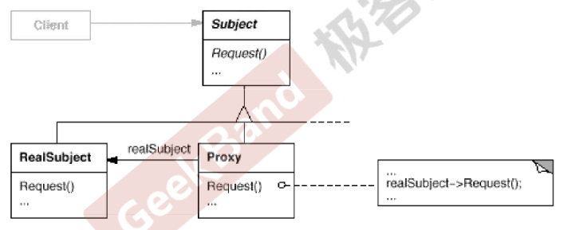

* 适配器模式

  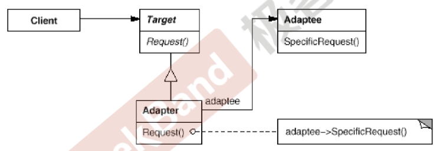

* 中介者模式

  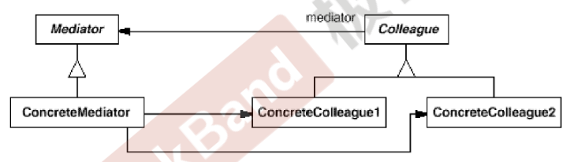

* 状态模式

  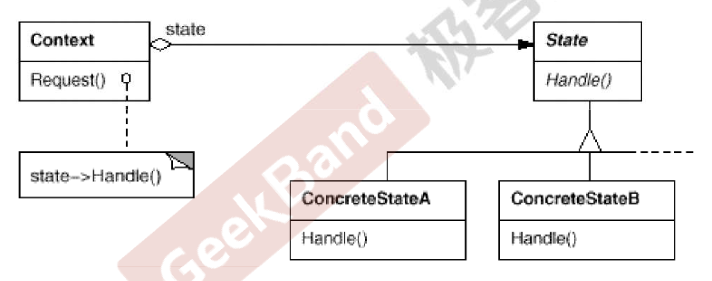

* 备忘录模式

  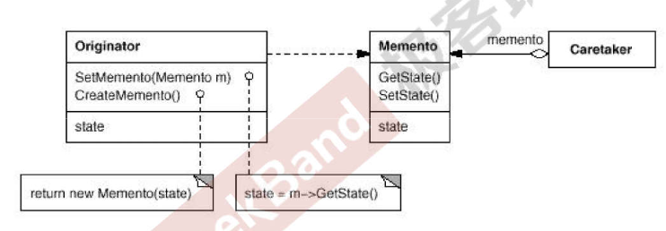

* 组合模式

  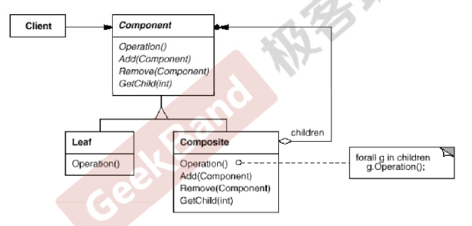

* 迭代器模式

  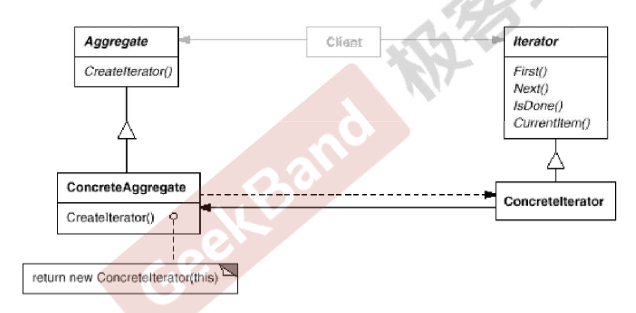

* 责任连模式

  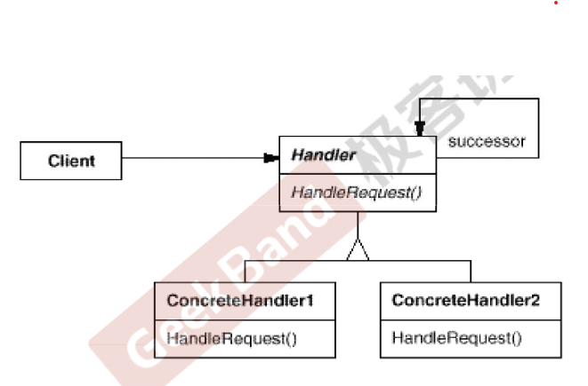

* 命令模式

  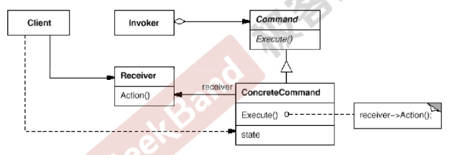

* 访问者模式

  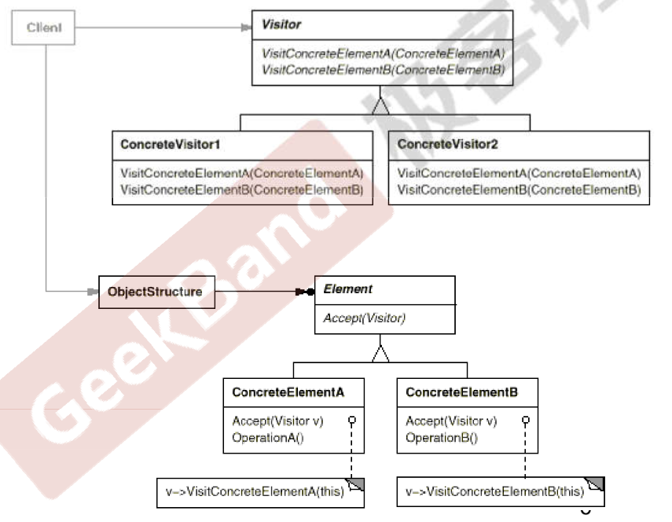

* 解释器模式

  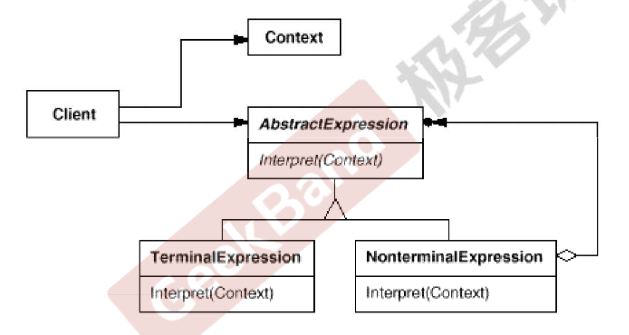

* 总结

  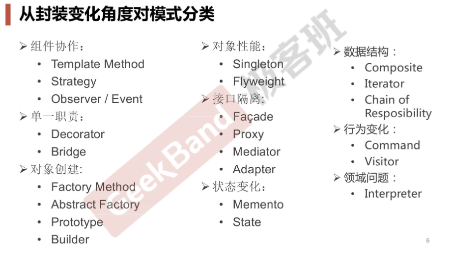
